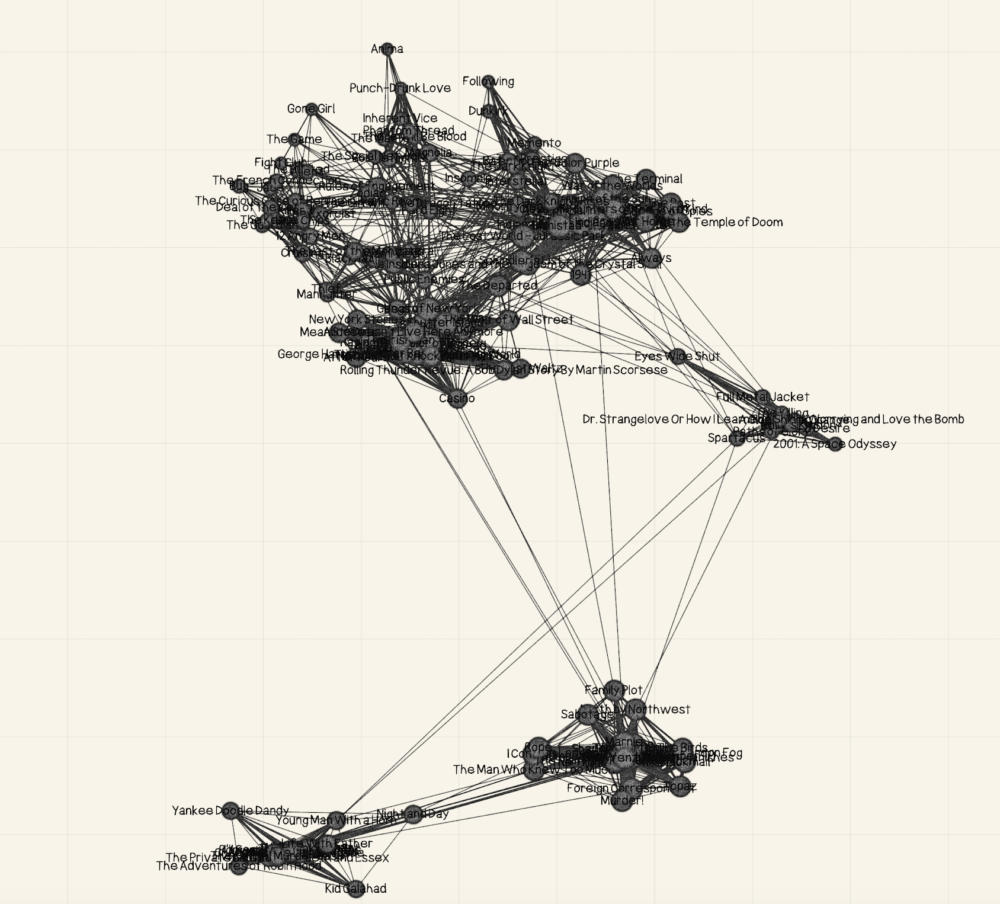

# Knot a Film

Knot a Film is a Swift-based application for exploring, visualizing, and analyzing a large dataset of movies and their relationships. The project leverages SwiftUI for its interactive UI, CoreML for machine learning-powered recommendations, and SwiftData for efficient data management.

<p align="center">
    
</p>

## Features

- **Graph Visualization:** Visualize movies as nodes in a graph, with connections based on shared actors, directors, or writers.
- **Search & Recommendation:** Search for movies and get recommendations using natural language and ML-powered embeddings.
- **Interactive Posters:** View detailed, dynamically styled movie posters with key information and visual effects.
- **Data Analytics:** Explore charts and analytics about genres, ratings, and more.
- **Custom Theming:** Enjoy a unique look with custom fonts and color themes.

## Project Structure

**External Resources:**
- `assets/` – External images and icons
- `dataset/` – Movie datasets (CSV, Excel, etc.)
- `python/` – Python scripts for data preprocessing
- `ml/` – CoreML embedding creation for recommendation and search

**App Source Code (`Knot a Film.swiftpm/`):**
- `data_manager/` – Data loading, parsing, and database logic
- `data_types/` – Core data models (Movie, MoviePerson, etc.)
- `graph/` – Graph algorithms and visualization logic
- `search/` – Recommendation and search engines
- `Resources/` – ML models, images, and other bundled assets
- `views/` – SwiftUI views (ContentView, NodeGraphView, PosterView, etc.)
- `data_analytics/` – Analytics and chart views
- `lib/` – Shared UI components (fonts, colors, etc.)
- `poster/` – Poster rendering and effects
- `Package.swift` – Swift package manifest
- `KnotAFilm.swift` – App entry point


## Getting Started

### Prerequisites

- Xcode 15 or later
- Swift 5.9+
- macOS 14+ (or iOS 17+ for target platforms)
- [SwiftData](https://developer.apple.com/documentation/swiftdata)
- [CoreML](https://developer.apple.com/documentation/coreml)

### Setup

1. **Clone the repository:**
    ```sh
    git clone https://github.com/yourusername/knot-a-film.git
    cd knot-a-film
    ```

2. **Prepare the dataset:**
    - Place your movie dataset CSVs in the `dataset/` folder.
    - Use the Python scripts in `python /` to preprocess or enrich the data if needed.

3. **Open in Xcode:**
    - Open `Knot a Film.swiftpm` in Xcode.
    - Build and run the project.

4. **First Launch:**
    - On first launch, the app will parse the dataset and initialize the database.

## Data Processing

- **Python Scripts:**  
  The `python/` directory contains scripts for converting CSV to JSON, extracting image colors, and downloading movie posters.
- **Swift DataManager:**  
  Handles loading, parsing, and saving movies and people into the SwiftData database.

## License

This project is licensed under the MIT License.

---

*Created by Owen O'Malley, 2025.*