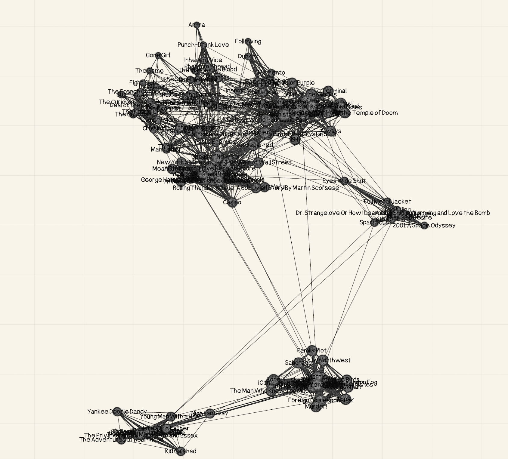
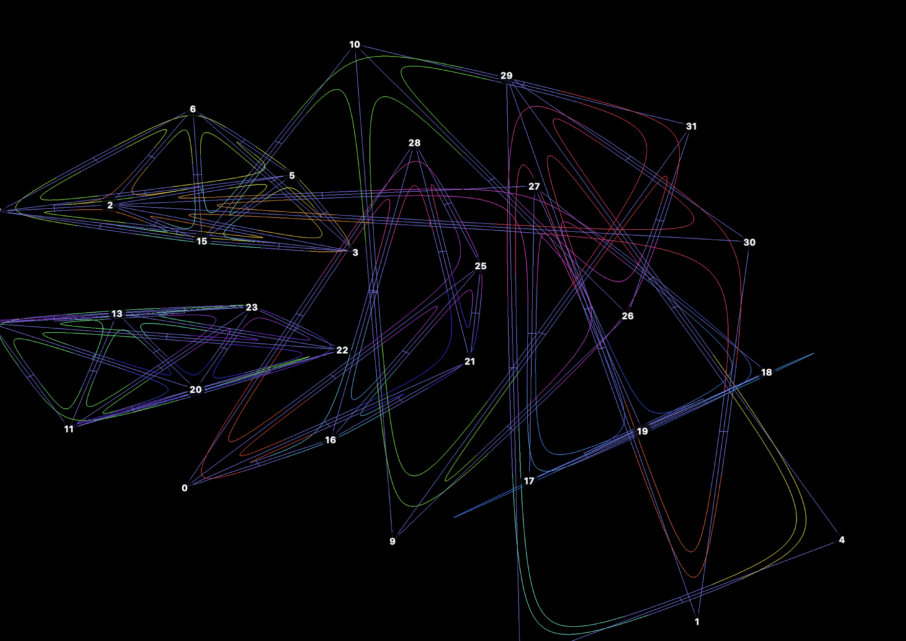

# Knot a Film

*We love maps with lines and dots,*<br>
*X marks places, paths, and spots.*<br>
*But scrolling movies? No fun at all—*<br>
*Just endless choices in one long crawl.*<br>
*What if movies had a map?*<br>
*Pick a path, tap, tap tap!*<br>

*My map special, I decree.*<br>
*Need not worry, you will see.*<br>
*Every mind’s a garden bright,*<br>
*tended gently, growing right.*<br>
*See the shape and you will find*<br>
*a little mirror of your mind.*<br>

Knot a Film is an application for visualizing the rotten tomatoes movie dataset more like a map. The project is migrating from traditional SwiftUI to a metal graphics pipeline

<p align="center">
    
    
</p>

## Getting Started

### Prerequisites

- Xcode 26 or later
- Swift 6.0+
- macOS 26+ 


### Setup

1. **Clone the repository:**
    ```sh
    git clone https://github.com/ThyOwen/knot-a-film.git
    cd knot-a-film
    ```

3. **Open in Xcode:**
    - Open `Knot a Film.swiftpm` in Xcode.
    - Build and run the project.

4. **First Launch:**
    - On first launch, the app may parse the dataset and initialize the database, or load the default.store.

*Created by Owen O'Malley, 2025.*