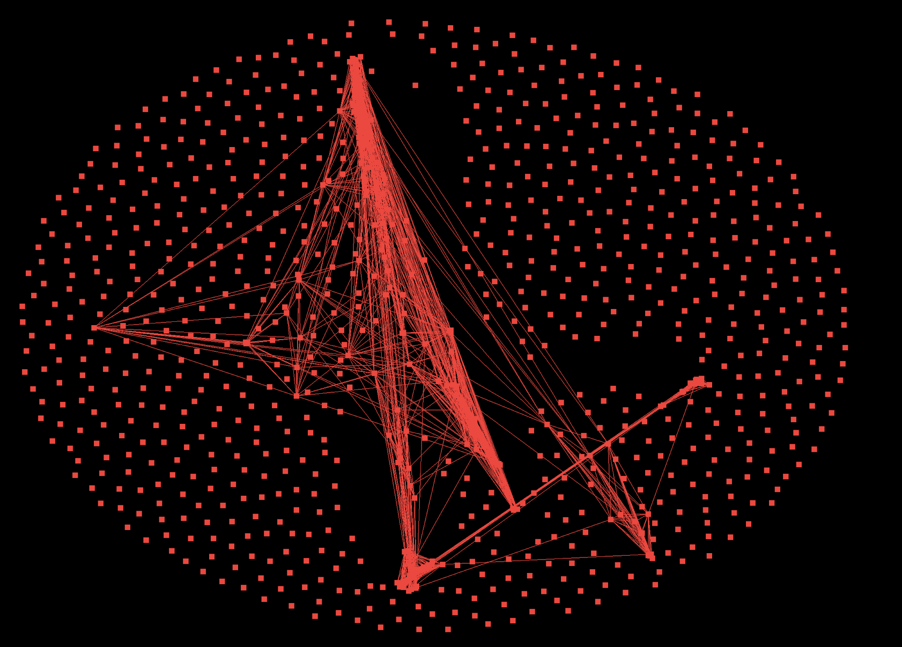

# Knot a Film

Knot a Film is a Swift-based application for exploring, visualizing, and analyzing the rotten tomatoes movie dataset. The project leverages SwiftUI for its interactive UI, CoreML for machine search and recommendations, SwiftData as and SQL frontend, and Metal for simulation and graphics. So the whole monty...

<p align="center">
    
    
</p>

## Project Structure

**External Resources:**
- `assets/` – External images and icons
- `dataset/` – Movie datasets (CSV, Excel, etc.)
- `python/` – Python scripts for data preprocessing
- `ml/` – CoreML embedding creation for recommendation and search

**App Source Code (`Knot a Film.swiftpm/`):**
- `backend/` – CSV parsing, search features, and n body simulation
- `Resources/` – ML models, the rotten tomatoes dataset, fonts, movie poster logos, shaders
- `views/` – SwiftUI views (ContentView, NodeGraphView, PosterView, etc.)

## Getting Started

### Prerequisites

- Xcode 26 or later
- Swift 6.0+
- macOS 26+ 


### Setup

1. **Clone the repository:**
    ```sh
    git clone https://github.com/ThyOwen/knot-a-film.git
    cd knot-a-film
    ```

3. **Open in Xcode:**
    - Open `Knot a Film.swiftpm` in Xcode.
    - Build and run the project.

4. **First Launch:**
    - On first launch, the app may parse the dataset and initialize the database, or load the default.store.

## Data Processing

- **Python Scripts:**  
  The `python/` directory contains scripts for extracting image colors, and downloading movie posters.


*Created by Owen O'Malley, 2025.*